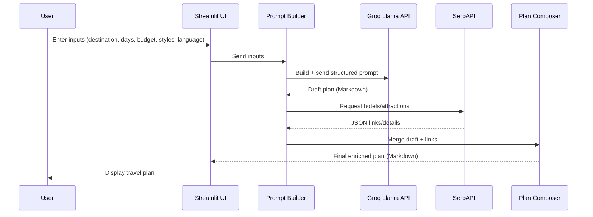
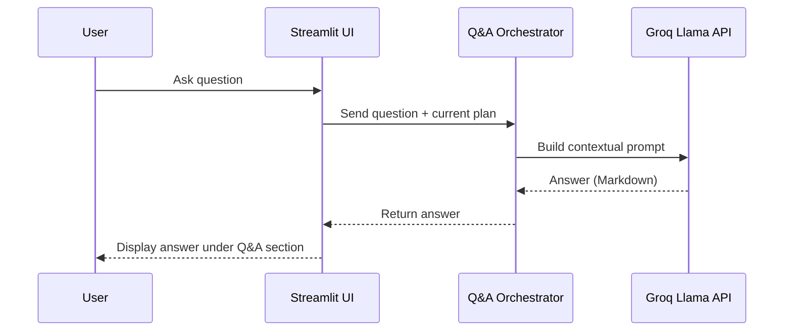
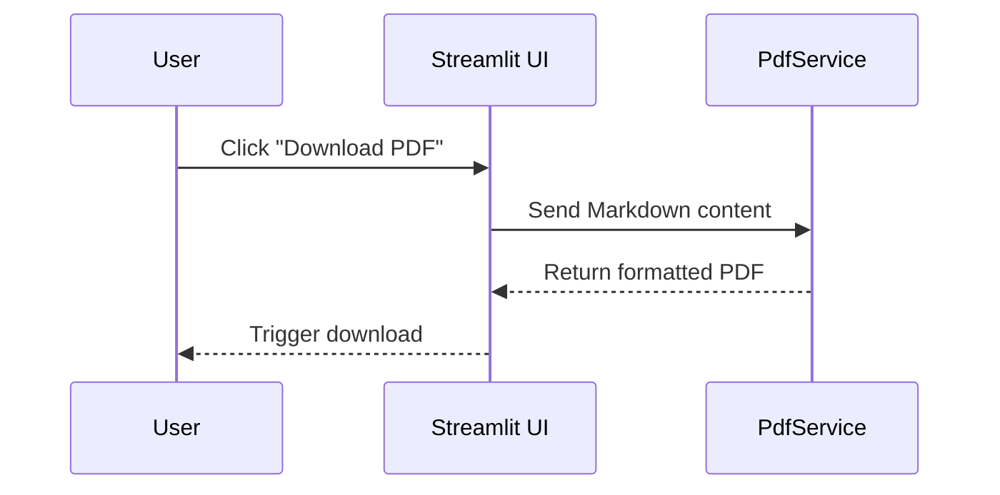

# Stage 3 — Technical Documentation  
## Task 0: Define User Stories and Mockups  

---

### 1. Inputs & Preferences (from current code)
- **Destination** *(text)*: User manually enters the city/target destination.  
- **Duration** *(number)*: Trip length (1–30 days).  
- **Budget** *(select slider)*: Options are **Budget | Moderate | Luxury**.  
- **Travel Styles** *(multi-select)*: `Culture, Nature, Adventure, Relaxation, Food, Shopping`.  
- **Answer Language** *(select)*: **Arabic | English** (output language only).  
- **Primary Actions**:  
  - **Generate My Perfect Travel Plan** → Structured prompt sent to the AI model, returning:  
    1. Best Time to Visit  
    2. Accommodation Recommendations (budget-aware)  
    3. Day-by-Day Itinerary  
    4. Culinary Experiences  
    5. Practical & Safety Tips (transport, etiquette, safety, daily budget)  
    6. Estimated Total Trip Cost + money-saving tips  
    + Source links included.  
  - **Q&A (Expander)** → Ask follow-up questions based on the generated plan.  

---

### 2. User Stories (MoSCoW Prioritization)

#### Must Have
1. **Enter destination and trip details**  
   *As a traveler, I want to enter my destination, duration, budget, and travel style, so that I can get a tailored plan.*  

2. **Generate an AI-based travel plan**  
   *As a traveler, I want to generate a structured travel plan, so that I can quickly organize my trip.*  

3. **Source-backed recommendations**  
   *As a traveler, I want the plan to include reliable source links, so that I can verify recommendations.*  

4. **Language toggle for output**  
   *As a traveler, I want to choose Arabic or English for my plan, so that I can read it comfortably.*  

#### Should Have
5. **Budget-aware accommodations**  
   *As a traveler, I want hotel suggestions aligned with my budget, so that I can book confidently.*  

6. **Q&A grounded in the generated plan**  
   *As a traveler, I want to ask clarifying questions, so that I can refine details without starting over.*  

7. **Export plan as PDF**  
   *As a traveler, I want to export my plan as a PDF, so that I can save or share it.*  

#### Could Have
8. **Email plan to myself**  
   *As a traveler, I want to send my plan to my email, so that I can access it later.*  

#### Won’t Have
9. **Automatic destination suggestions** → Out of scope.  
10. **In-app bookings** → Out of scope.  

---

### 3. Mockups (Wireframe Descriptions)

1. **Screen A — Trip Settings (Centered Form)**  
   - Fields: Destination, Duration, Budget, Travel Styles, Answer Language, [Generate Plan].  
   - Layout: Clean vertical layout in the **center of the page**.  
   - Background: A collage of travel destinations with a subtle overlay.  

2. **Screen B — Plan View**  
   - Header: Destination, Duration, Budget, Styles (summary).  
   - Sections: Best Time to Visit, Day-by-Day Itinerary, Accommodations, Culinary Experiences, Practical & Safety Tips, Estimated Cost.  
   - Footer: [Export PDF] [Regenerate Plan].  

3. **Screen C — Q&A Panel**  
   - Input: “Ask a question about your plan…”  
   - Answer: Shown in Markdown, grounded in the generated plan.  
   - Empty State: “Generate a plan first.”  

---

### 4. UI Mockup Preview  

/ui_mockup.png)

---

### 5. Notes for Implementation
- **Prompting:** Structured input sent to AI (Groq Llama) including user data and instructions.  
- **Source Links:** Verified using SerpAPI to fetch live, accurate references.  


## Task 1: Design System Architecture

### High-Level Overview
The MVP is a web application that generates a concise, source-backed travel plan using an AI model and web search enrichment. It runs as a stateless front end (Streamlit) with no persistent database in the MVP. External services include Groq (LLM) and SerpAPI (web search). Session data is kept in memory.

---

### Components
- **Frontend (Streamlit Web App)**
  - UI for inputs: Destination, Duration, Budget (Budget/Moderate/Luxury), Travel Styles (multi-select), Answer Language.
  - Actions: “Generate Plan”, Q&A (expander), Export to PDF.
  - Holds ephemeral state in `st.session_state` (e.g., generated plan).

- **Prompt Builder (in-app)**
  - Transforms user inputs into a structured prompt (instructions + constraints).
  - Controls output length/format (Markdown ~600 words) and requires source links.

- **LLM Service**
  - **Groq (Llama)** via API.
  - Returns the initial plan: best time to visit, day-by-day itinerary, budget-aware stays, culinary highlights, practical & safety tips, estimated total cost.

- **Search/Enrichment Service**
  - **SerpAPI** (Google Search / Maps / Hotels endpoints as needed).
  - Fetches verifiable links, updated hotel/attraction details, and supporting references to enrich/validate the AI output.

- **Plan Post-Processor (in-app)**
  - Normalizes/merges AI text with SerpAPI results (e.g., add links/titles, ensure sections exist).
  - Produces final Markdown for rendering and export.

- **PDF Exporter (in-app)**
  - Converts the rendered Markdown plan to a downloadable PDF.

- **(Optional / Future) Persistence**
  - Not part of MVP. If needed later: SQLite/PostgreSQL for saved plans and analytics.

---

### Data Flow Diagram

/data_flow_diagram.png)

---

### Request/Response Paths
1. **Generate Plan**
   - FE → Prompt Builder → LLM → SerpAPI → Post-Processor → FE (render Markdown) → PDF (on demand).

2. **Q&A**
   - FE (question) → Q&A Handler (injects plan context) → LLM → FE (render answer).

---

### Notes on Scalability & Efficiency
- **Stateless UI** for the MVP; state is session-only. Horizontal scaling is straightforward if needed (behind a reverse proxy).
- **Rate limits & resilience**
  - Cache SerpAPI queries (short TTL) where possible.
  - Graceful fallbacks (reduced results or static examples) on external failure.
- **Security & Secrets**
  - Keep API keys in environment/secrets (no client exposure).
  - Validate/escape user inputs; never render untrusted HTML.
- **Performance**
  - Constrain LLM output length and sections.
  - Defer enrichment (SerpAPI) to only required sections.
- **Internationalization**
  - Language toggle drives prompt instructions and UI text; content generation remains deterministic per language.

---

### Technology Choices (MVP)
- **Frontend:** Streamlit (fast iteration, simple state handling).
- **LLM:** Groq (Llama) via API for plan generation & Q&A.
- **Search:** SerpAPI for reliable, structured web results and links.
- **PDF:** Markdown → PDF converter (tooling within app environment).
- **Database:** None for MVP (future: SQLite/PostgreSQL if persistence is required).

---

### Deliverable
- **Diagram illustrating the architecture and data flow** (linked above).
- **Accompanying description** of each component and integration points.

## Task 2: Define Components, Classes, and Database Design

### 0) Design Rationale (MVP – Front-End Only)
This MVP intentionally ships **without a dedicated back-end or database**.  
All state is **ephemeral and stored in-memory** on the client app (session state), and external services are used for computation and data enrichment.  
This minimizes complexity, speeds up delivery, and fully satisfies current functional requirements.

---

### 1) Logical Components (No Server Back-End)
- **UI Layer (Streamlit App)**
  - Collects inputs: Destination, Duration, Budget Tier (Budget/Moderate/Luxury), Travel Styles (multi-select), Output Language.
  - Actions: Generate Plan, Q&A (contextual), Export PDF.
  - Holds transient data in session state.

- **Prompt Orchestrator (Client-Side Module)**
  - Builds a structured prompt from user inputs and output constraints (Markdown, ~600 words, sections, sources).

- **AI Generation (External Service)**
  - Groq Llama API returns the initial travel plan.

- **Search/Enrichment (External Service)**
  - SerpAPI fetches reliable links and up-to-date references (hotels/attractions/infos).

- **Plan Post-Processor (Client-Side Module)**
  - Merges AI text with enriched links; ensures sections exist; normalizes the final Markdown.

- **PDF Exporter (Client-Side Module)**
  - Converts rendered Markdown into a downloadable PDF.

> **Note:** There is **no server back-end** in the MVP.  
> If needed later, a thin API layer can be introduced without breaking the current UI.

---

## 2. Define Components, Classes, and Database Design

### Purpose
To detail the internal structure of the system components for the MVP. Since this project is front-end focused with no persistence requirements, the documentation explains the in-memory model and outlines how components interact without back-end or database dependencies.

### 1) Back-End Components
- No back-end service is included in the MVP.
- All logic is handled client-side within the Streamlit application.
- If persistence or APIs are required in the future, a thin back-end layer (e.g., FastAPI/Node.js) can be added with minimal refactoring.

### 2) Data Model (In-Memory – No DB)
The app keeps transient state only; no persistence beyond the session.

Example JSON structure:
{
  "inputs": {
    "destination": "string",
    "duration": 1,
    "budgetTier": "Budget | Moderate | Luxury",
    "travelStyles": ["Culture", "Nature", "Adventure", "Relaxation", "Food", "Shopping"],
    "language": "Arabic | English"
  },
  "plan": "Markdown string (final enriched plan)",
  "qa": [
    { "q": "string", "a": "Markdown string" }
  ]
}

### 3) Database (Future Consideration)
No Database (ERD/Collections) for MVP

No database is required for the MVP. If persistence is introduced later:

Relational Example (SQL):
plans(id, destination, duration, budget, styles_json, language, plan_md, created_at)

Document Example (JSON):
plans {
  "destination": "Paris",
  "duration": "7 days",
  "budget": "medium",
  "styles": ["cultural", "culinary"],
  "language": "English",
  "plan_md": "...",
  "created_at": "2025-09-22"
}

### 4) Front-End UI Components & Interactions
- Inputs Panel (Centered Form): destination, duration, budgetTier, travelStyles, language, [Generate]
- Plan View: summary (chips) + sections (best time, itinerary, accommodations, culinary, tips, cost)
- Q&A Expander: question → answer grounded in current plan
- Export: [Download PDF]

Interaction Flow (High-Level):
1. User fills inputs → PromptOrchestrator builds structured prompt
2. AiClient (LLM API) generates draft plan
3. SearchClient (SerpAPI) fetches supporting links/details
4. PlanComposer merges and normalizes → UI renders Markdown
5. (Optional) QA uses current plan as context
6. Export via PdfService

### 5) Technical Justification
- No Back-End / No DB: not a current requirement; reduces complexity and time-to-value
- LLM + SerpAPI: cover computation and fresh references without storing user data
- In-Memory State: sufficient for single-session usage; avoids authentication/storage overhead
- Future-Ready: a server API or persistence layer can be added later with minimal refactoring


# Task 3: Create High-Level Sequence Diagrams

## Purpose
To show how components or services interact for key use cases in the Smart Travel Website MVP.

---

## Key Use Cases
1. **Generate Travel Plan**
   - Traveler enters inputs (destination, duration, budget, travel styles, language).
   - System builds a structured prompt.
   - LLM generates a draft plan.
   - SerpAPI enriches the plan with current hotels/attractions.
   - PlanComposer merges content and normalizes structure.
   - UI renders final Markdown plan.

2. **Ask a Question (Q&A)**  
   - Traveler submits a follow-up question.  
   - System uses current travel plan as context.  
   - LLM generates a concise, contextualized answer.  
   - UI displays the answer under the Q&A expander.

3. **Export Plan as PDF**  
   - Traveler clicks "Download PDF".  
   - PdfService formats Markdown content.  
   - System generates a styled PDF file.  
   - Traveler downloads the plan.

---

## Sequence Diagrams

### 1) Generate Travel Plan


### 2) Q&A on Plan


### 3) Export Plan as PDF


---

## Deliverables
- Three sequence diagrams showing interactions for:
  1. Travel plan generation.  
  2. Question answering.  
  3. Exporting plan as PDF.

# Task 4: Document External and Internal APIs

## Purpose
Specify how the system interacts with **external APIs** and define the project’s **internal API** (planned interface for future extensibility).

---

## External APIs

| API | Base URL | Why Chosen | Auth | Typical Use |
|---|---|---|---|---|
| **Groq Llama (LLM)** | `https://api.groq.com` | High‑quality, fast text generation to produce structured travel plans and Q&A. | API Key (Bearer) | Generate a concise plan and contextual answers. |
| **SerpAPI (Search/Maps/Hotels)** | `https://serpapi.com` and Google endpoints via SerpAPI proxy | Reliable, up‑to‑date web results (hotels, attractions, official pages) with a unified JSON schema. | API Key | Enrich plan with verified links/details. |

> **Note (MVP):** Calls are orchestrated client‑side. No server back‑end is required to function; the internal API below defines a future‑ready contract if a thin server layer is added later.

### Example – Groq Llama (pseudo)
**Endpoint:** `POST https://api.groq.com/openai/v1/chat/completions`  
**Headers:** `Authorization: Bearer <GROQ_API_KEY>`  
**Body (JSON):**
```json
{
  "model": "llama-3.3-70b-versatile",
  "messages": [
    {"role": "system", "content": "You are a travel planning assistant."},
    {"role": "user", "content": "Generate a 5-day plan for Tokyo with moderate budget in English..."}
  ]
}
```
**Response (truncated):**
```json
{
  "id": "cmpl_123",
  "choices": [
    { "message": { "role": "assistant", "content": "## Best Time to Visit\n..."} }
  ]
}
```

### Example – SerpAPI (pseudo)
**Endpoint:** `GET https://serpapi.com/search.json`  
**Query:** `q=best hotels in paris&engine=google&api_key=<SERPAPI_KEY>`  
**Response (truncated):**
```json
{
  "search_metadata": { "status": "Success" },
  "organic_results": [
    { "title": "Hotel A", "link": "https://example.com/hotel-a" }
  ]
}
```

---

## Internal API (Planned, Optional Server Layer)

**Base URL:** `https://your-domain.example/api`  
**Auth (MVP):** none (can add Bearer/Session later)  
**Content Types:** `application/json` (for data), `application/pdf` (for file response)

### Endpoints Overview
| Method | Path | Purpose | Input | Output |
|---|---|---|---|---|
| `POST` | `/plan/generate` | Generate AI travel plan | JSON (inputs) | JSON (plan markdown + sources) |
| `POST` | `/plan/qa` | Answer a question using current plan context | JSON | JSON (answer markdown) |
| `POST` | `/plan/export` | Export plan as PDF | JSON (markdown) | PDF (binary) or URL |
| `GET` | `/health` | Health check | — | JSON status |

---

### 1) `POST /plan/generate`
**Purpose:** Build a structured prompt from inputs, call LLM, enrich via SerpAPI, return a finalized plan.

**Request (JSON):**
```json
{
  "destination": "Paris",
  "duration": 5,
  "budgetTier": "Moderate",
  "travelStyles": ["Culture", "Food"],
  "language": "English"
}
```

**Response (JSON):**
```json
{
  "plan_markdown": "## Best Time to Visit\n...",
  "sources": [
    {"title": "Official Tourism", "url": "https://parisinfo.com"},
    {"title": "Hotel A", "url": "https://example.com/hotel-a"}
  ],
  "meta": { "model": "llama-3.3-70b-versatile", "generated_at": "2025-09-22T10:00:00Z" }
}
```

**Errors:**
```json
{ "error": { "code": "INPUT_INVALID", "message": "destination is required" } }
```

---

### 2) `POST /plan/qa`
**Purpose:** Receive a user question and the current plan context, return a concise answer.

**Request (JSON):**
```json
{
  "question": "Is the metro safe at night?",
  "plan_context": "## Best Time to Visit\n... (current plan markdown, truncated)",
  "language": "English"
}
```

**Response (JSON):**
```json
{
  "answer_markdown": "**Short answer:** ...\n\n**Tip:** ...",
  "sources": [
    {"title": "Transit Authority", "url": "https://tmb.cat/en"}
  ]
}
```

**Errors:**
```json
{ "error": { "code": "LLM_UNAVAILABLE", "message": "Try again later" } }
```

---

### 3) `POST /plan/export`
**Purpose:** Convert the current plan markdown into a styled PDF.

**Request (JSON):**
```json
{
  "plan_markdown": "## Best Time to Visit\n...",
  "file_name": "smart-travel-plan-paris.pdf"
}
```

**Response (Binary or JSON):**
- **Binary:** `application/pdf` stream  
- **or JSON:**  
```json
{ "pdf_url": "https://your-domain.example/storage/smart-travel-plan-paris.pdf" }
```

**Errors:**
```json
{ "error": { "code": "PDF_FAILED", "message": "Unable to render PDF" } }
```

---

### 4) `GET /health`
**Purpose:** Simple health check.

**Response:**
```json
{ "status": "ok", "service": "smart-traveler-api", "time": "2025-09-22T10:00:00Z" }
```

---

## Cross‑Cutting Concerns

- **Rate Limits:** Respect Groq/SerpAPI quotas; implement basic throttling if server is added.  
- **Observability:** Log request IDs, model used, latency, and error codes.  
- **Security:** Keep API keys server-side when a server exists; never expose secrets to clients.  
- **Internationalization:** `language` input controls output language (Arabic/English).  
- **Error Model:** Consistent shape — `{ "error": { "code": "...", "message": "..." } }`.

---

## Deliverables
- List of external APIs (Groq Llama, SerpAPI) with purpose and sample usage.  
- Internal API contract (planned): endpoints, methods, inputs/outputs, and error model.

# Task 5: Plan SCM and QA Strategies

## Purpose
To establish procedures for managing code, the development lifecycle, and ensuring quality.

---

## 1. Source Control Management (SCM)

**Tool:** Git (via GitHub).

**Branching Strategy:**
- `main`: Stable branch for production-ready code.
- `dev`: Integration branch for ongoing development.
- `feature/*`: Each new feature or task is developed in its own branch.

**Processes:**
- Regular commits with descriptive messages.
- Pull Requests (PRs) required for merging feature branches into `dev`.
- Code reviews by at least one peer before merging.
- Merges into `main` happen only after QA approval.

---

## 2. Quality Assurance (QA)

**Testing Strategy:**
- **Unit Testing:** For modular validation (e.g., input parsing, PDF export).  
- **Integration Testing:** Ensure LLM + SerpAPI integration works end-to-end.  
- **Manual Testing:** Validate UI flows (inputs → plan → Q&A → export).

**Tools:**
- `pytest`: For unit and integration tests (Python).  
- `Postman`: For testing API endpoints if exposed later.  
- `Streamlit testing utilities`: Manual/automated checks of the UI.  

**Pipeline:**
- **Local Development:** Developers run unit tests before commits.  
- **CI Pipeline (GitHub Actions):** Automatically runs tests on every PR.  
- **Staging Deployment (Optional):** Deploy preview version for manual QA.  
- **Production Deployment:** Merge into `main` triggers production release.

---

## Deliverables

- **SCM Strategy:**
  - GitHub-based, with branching (`main`, `dev`, `feature/*`).
  - Mandatory PR reviews before merges.
  - Commit hygiene enforced.

- **QA Strategy:**
  - Unit, integration, and manual testing.  
  - Tools: pytest, Postman, Streamlit utilities.  
  - CI pipeline with automated test execution.

---

## Benefits

- **SCM:** Ensures stable main branch, prevents unreviewed code from entering production.  
- **QA:** Detects bugs early, ensures reliable LLM + SerpAPI integration, improves confidence in MVP delivery.


