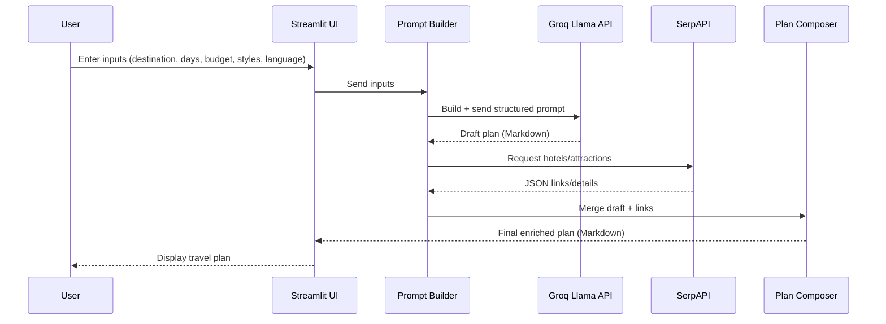
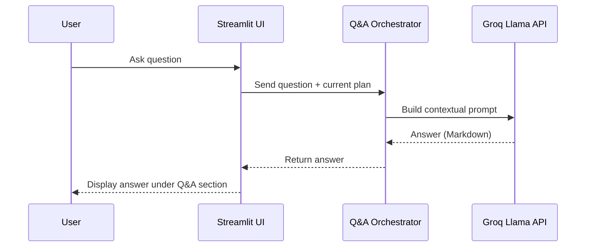
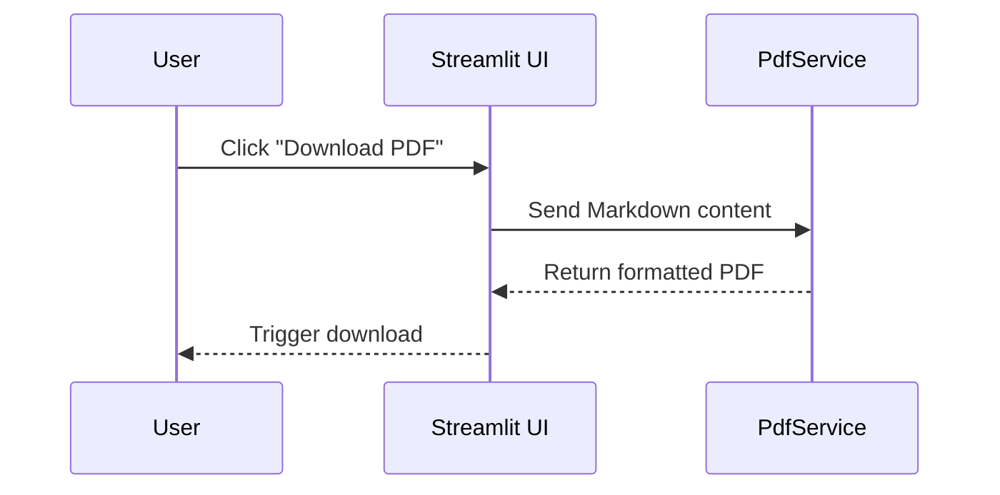

# Task 3: Create High-Level Sequence Diagrams

## Purpose
To show how components or services interact for key use cases in the Smart Travel Website MVP.

---

## Key Use Cases
1. **Generate Travel Plan**
   - Traveler enters inputs (destination, duration, budget, travel styles, language).
   - System builds a structured prompt.
   - LLM generates a draft plan.
   - SerpAPI enriches the plan with current hotels/attractions.
   - PlanComposer merges content and normalizes structure.
   - UI renders final Markdown plan.

2. **Ask a Question (Q&A)**  
   - Traveler submits a follow-up question.  
   - System uses current travel plan as context.  
   - LLM generates a concise, contextualized answer.  
   - UI displays the answer under the Q&A expander.

3. **Export Plan as PDF**  
   - Traveler clicks "Download PDF".  
   - PdfService formats Markdown content.  
   - System generates a styled PDF file.  
   - Traveler downloads the plan.

---

## Sequence Diagrams

### 1) Generate Travel Plan

### 2) Q&A on Plan

### 3) Export Plan as PDF

---

## Deliverables
- Three sequence diagrams showing interactions for:
  1. Travel plan generation.  
  2. Question answering.  
  3. Exporting plan as PDF.
